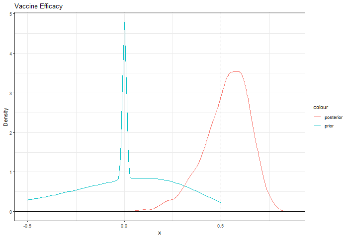

```{r, include = FALSE}
knitr::opts_chunk$set(
  collapse = TRUE,
  out.width = "100%"
)
```

## Overview

There is interest in understanding how ending vaccine trials early at the time of interim analyses would affect inference on vaccine efficacy. A Bayesian approach is a way to gain some insight by answering the question "What is the probability that vaccine efficacy exceeds 50%, given certain prior assumptions and ending the study early?" Ending the study early is defined as observing a certain number of cases across both vaccine and placebo arms of the trial. 

## Some Results

Below is an example of 3000 subjects at enrollment, where the analysis was stopped at 30 observed cases with 10 of them observed in the vaccine arm. 

```{r, eval=FALSE}
#' @param rratio randomization ratio: # vax / # total
#' @param cases total cases at time of interim analysis
#' @param vax_cases number of cases of total cases in vax arm
#' @param N total number of subjects (vax and placebo) at enrollment
  
#' @param lambda vector of mixing proportions
#' @param mu vector mean of logRR ~ N(mu_i, sigma_i)
#' @param sigma vector sd of logRR ~ N(mu_i, sigma_i)

#' @param alpha param of theta0 ~ Beta(alpha, beta)
#' @param beta param of theta0 ~ Beta(alpha, beta)
  
sim <- vaccine_sim(rratio=2/3, 
                   cases=30, 
                   vax_cases=10, 
                   N=3000, 
                   lambda=c(.1, .45, .45), 
                   mu=c(0, -.38, -.1), 
                   sigma=c(0.01, .325, .325), 
                   alpha=.15, beta=10, iter=1000)
```





