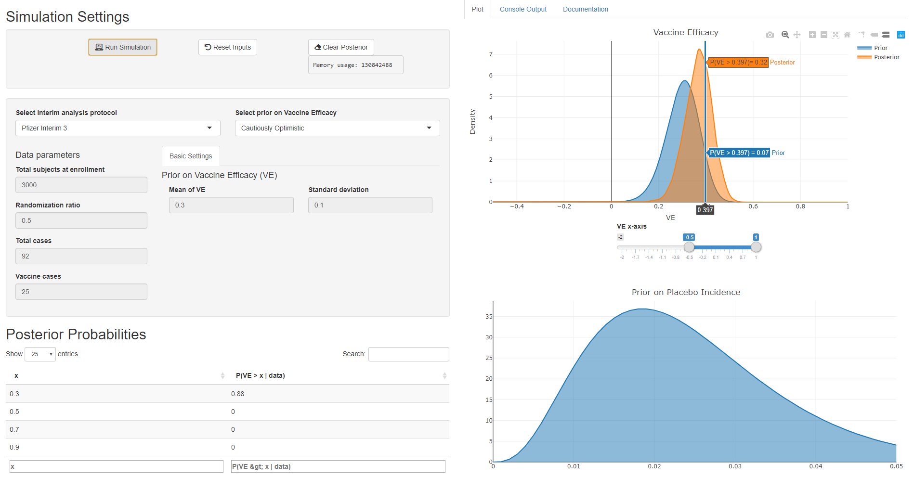

## Overview

There is interest in understanding how ending vaccine trials early at
the time of interim analyses in randomization trials would affect inference on vaccine efficacy (VE). A Bayesian approach can offer insight by allowing us to estimate the probability that VE exceeds a certain threshold, given prior assumptions on VE. Ending the
study early is defined as observing a given number of cases across
both vaccine and placebo arms of the trial. Pfizer, Moderna, and other companies have offered details on when they decided to end the trials. 

## Shiny interface

The visualization allows the user to first select 1) a prior on the VE mean and standard deviation 2) the interim analysis endpoint to be used as data. Once those two options are selected, the button "Run Simulation" will feed the prior and data into a Stan model that calculates the posterior VE distribution in the background. The user can then visualize the prior and posterior distributions of VE together. 

Below is an example of the Pfizer Interim endpoint 3, with 3000 subjects at enrollment, a 50% randomization ratio, 25 out of 92 observed cases occurring in the vaccine arm and a "Cautiously Optimistic" prior on VE. 

## Deployment Architecture
This containerized application (webservice) is deployed on Amazon Web Services (AWS) using the Elastic Container Service (ECS). The webservice is deployed on Fargate using an Application Load Balancer that routes traffic from TCP/80 (HTTP) to TCP/3838 in each container. The load balancer routes traffic to one of two containers that are deployed to support the service. When a new session is initiated, the load balancer assigns the session to a specific container and will route traffic to that container until the end of the session (this is required to facilitate the Websockets used by ShinyApp.)  In the event that a container fails or is terminated, it will be automatically restarted by the ECS service. There is no authentication on the application. Anyone with the URL may access it!

### Deployment Procedure
Deployment is straightforward. First, ensure your shell has `AWS_ACCESS_KEY_ID` and `AWS_SECRET_ACCESS_KEY` set in the environment.

Make your changes, then build a new image:

`make build`

Push the image to ECR:

`make push`

Re-deploy the service to expose the updated web application:

`make deploy`

### Monitoring
There is a [dashboard in Cloudwatch](https://us-east-2.console.aws.amazon.com/cloudwatch/home?region=us-east-2#dashboards:name=Vaccine-Efficacy-Webservice;start=PT12H) that shows the status of the service.

### Known Issues
The ShinyApp uses websockets to communicate between the browser and server. Since the load balancer can route traffic to one of any number of containers, sessions are "assigned" to a container and subsequence requests via the lb will be routed to the container that opened the websocket. These sessions time out after 60 minutes, so some WebSocket errors may be encountered if a browser window is left open for longer than an hour. Refreshing the page will fix this.
