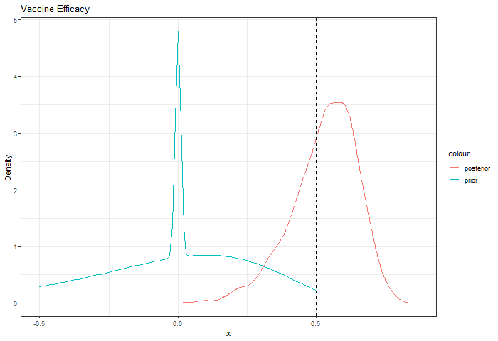

## Overview

There is interest in understanding how ending vaccine trials early at
the time of interim analyses would affect inference on vaccine efficacy.
A Bayesian approach is a way to gain some insight by answering the
question “What is the probability that vaccine efficacy exceeds 50%,
given certain prior assumptions and ending the study early?” Ending the
study early is defined as observing a certain number of cases across
both vaccine and placebo arms of the trial.

## Some Results

Below is an example of 3000 subjects at enrollment, where the analysis
was stopped at 30 observed cases with 10 of them observed in the vaccine
arm.

``` r
#' @param rratio randomization ratio: # vax / # total
#' @param cases total cases at time of interim analysis
#' @param vax_cases number of cases of total cases in vax arm
#' @param N total number of subjects (vax and placebo) at enrollment
  
#' @param lambda vector of mixing proportions
#' @param mu vector mean of logRR ~ N(mu_i, sigma_i)
#' @param sigma vector sd of logRR ~ N(mu_i, sigma_i)

#' @param alpha param of theta0 ~ Beta(alpha, beta)
#' @param beta param of theta0 ~ Beta(alpha, beta)
  
sim <- vaccine_sim(rratio=2/3, 
                   cases=30, 
                   vax_cases=10, 
                   N=3000, 
                   lambda=c(.1, .45, .45), 
                   mu=c(0, -.38, -.1), 
                   sigma=c(0.01, .325, .325), 
                   alpha=.15, beta=10, iter=1000)
```



## Deployment Architecture
This containerized application (webservice) is deployed on Amazon Web Services (AWS) using the Elastic Container Service (ECS). The webservice is deployed on Fargate using an Application Load Balancer that routes traffic from TCP/80 (HTTP) to TCP/3838 in each container. The load balancer routes traffic to one of two containers that are deployed to support the service. When a new session is initiated, the load balancer assigns the session to a specific container and will route traffic to that container until the end of the session (this is required to facilitate the Websockets used by ShinyApp.) In the event that a container fails or is terminated, it will be automatically restarted by the ECS service. There is no authentication on the application. Anyone with the URL may access it!

### Deployment Procedure
Deployment is straightforward. First, ensure your shell has `AWS_ACCESS_KEY_ID` and `AWS_SECRET_ACCESS_KEY` set in the environment.

Make your changes, then build a new image:

`make build`

Push the image to ECR:

`make push`

Re-deploy the service to expose the updated web application:

`make deploy`

### Monitoring
There is a [dashboard in Cloudwatch](https://us-east-2.console.aws.amazon.com/cloudwatch/home?region=us-east-2#dashboards:name=Vaccine-Efficacy-Webservice;start=PT12H) that shows the status of the service.
